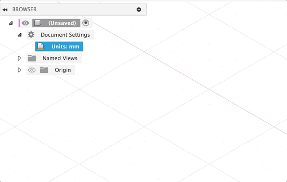
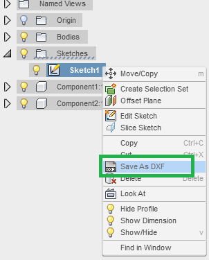

# Preparing Files for Water Jet & Metal Laser Cutter

The water jet and metal laser cutter require special file preparation, follow the guide below to make sure your file is ready to go. 

## Main Considerations

There are 4 main considerations for preparing a file for the water jet or laser cutter;

1. **Only include geometry you want to cut!** The machine will follow and cut every line. Remove any additional or extraneous lines and markings, such as dimensions, title blocks, etc.
2.  **Make sure things are 1:1 scale!** The machine will process the literal dimensions of the DXF to determine cut size. 

    !!! warning "Warning on Units"

        The water jet and metal laser cutter both assume files are in inches, so make sure your file is in inches once exported. If not, the file will be obviously very large/small.

3. **Export Discrete Parts!** While it may be tempting to lay out and nest parts in CAD to save materials, it is better to do this in the respective software for the machine used to cut the parts. You should export each part as its own DXF file. That being said, if you need 30 copies of a file, don't export the file 30 times.
4. **Include additional details in supporting documents!** Provide as much additional detail as possible for the operator, such as material type, critical dimensions, preferred orientation, etc. in a separate supporting document, if needed.

## File Export

The water jet and metal laser cutter only operate using a DXF file, which can be exported from any CAD package. Below are some specific instructions for some software;

??? note "Exporting from Autodesk Fusion"

    When exporting form Autodesk Fusion, **do not** use Export > DXF! This creates a 3D DXF. Instead, do the following;

    !!! warning "Warning on Units"

        Before continuing, it is suggested to change your units in Fusion to Inches, to ensure proper scale once exported. To do so, find the units option under "Document Settings" in the browser.

        
    
    1. Create a sketch on the face of the part
    2. Find the sketch in the browser
    3. Right-click the sketch name and hit "Save As DXF"

    

??? note "Exporting from OnShape"

    !!! warning "Warning on Units"

        Before continuing, it is suggested to change your units in OnShape to Inches, to ensure proper scaling once exported. To do so, hit "Workspace units..." in the hamburger menu, as seen below;

        

    Once your units are properly set, simply right-click on any face, and hit "Save as DXF"

??? note "Exporting from Solidworks"

    Solidworks does not have a great way to export DXFs. The suggested workflow is;

    1. Create a new engineering drawing, 1:1 scale, imperial (inch) units
    2. Create a view of the side profile of the part you want to cut
    3. Delete the title block and all other drawing-related frame components
    4. Export the drawing as a DXF. 

    This workflow is very likely to cause duplicate lines (since the "other side" of the part is still underneath the "visible side" of the part) so make sure to pay close attention during the subsequent cleaning steps. 

## Import: OMAX Layout

!!! tip "Follow Along!" 

    Want to follow along to make sure you are doing things exactly right? Download the file used in these example images at the link below;

    [Download "Tiger Outline.dxf"](./assets/tiger%20outline.dxf){.md-button}

Once we have created the DXF file, we can move it to OMAX Layout, the software we will use to sanitize the DXFs. OMAX Layout can be found on all computers in the [Maker Classroom, SHED 11-1330](https://maps.rit.edu/details/3197){target="_blank"}.

Once you open OMAX Layout, hit *File > Import From Other CAD...* to open your file. You should hopefully see your file pop up. If so, hit the "OK" button to continue. Don't worry about changing any other settings in this page! All that matters is we see (vaguely) our correct file.

## Scale: OMAX Layout

When we have our file in OMAX Layout, the first thing we should check is the scale. As a benchmark, the grid pattern in OMAX Layout is 1 x 1 inches by default, and the canvas has a total size of 24 x 48 inches by default. If your part appears to be much larger than this (like in the picture above), this is a good sign something is wrong. 

You can more precisely check the dimensions of something using the "Measure" tool at the bottom of the screen. Select the tool, then click on 2 spots. The software will tell you the distance (in inches) between these two spots in a popup window in the top left corner. 

!!! info "Scaling Size Discrepancies" 

    When there is an issue with scale, the design will be **extremely** incorrectly scaled, usually in the realm of 10x to 25x bigger/smaller

If your file is the incorrect scale, you can fix it using the "Size" tool, located in the left menu of the software. 

Once you select the Size tool, a menu will pop up. You can either enter a scaling ratio (i.e. 1/25.4 to convert from millimeters to inches) or enter the desired width/height of the part in inches. Make sure to keep **"Maintain aspect ratio"** checked, or it can scale your part in odd ways! 

Once you have the scale desired, hit "Ok" at the bottom to apply the scale. 

## Move: OMAX Layout

After scaling a part, or sometimes naturally from the software you export from, the vector will be far from the origin (i.e. bottom-left corner of the file). It is ideal for the vector to be at or near the origin of the file before proceeding. 

To move the design, hit the "Move" tool on the right, and select a reference point. The entire file will begin to move relative to the point you clicked, then simply click again once the file is closer to the origin. 

!!! note "Line Color"

    After moving the file, you may notice the file has changed from *green* lines to *yellow* lines. This simply means the vector(s) are selected. To correct this, right click the "Deselect" tool in the left menu, and hit "All" to deselect all lines.

## Delete: OMAX Layout

If there are any aspects of your DXF that should not be cut (watermarks, title blocks, dimensions, etc.), now is the time to remove them. If there are no such elements in your design, you can move on to the next step.

The deletion tools in OMAX are relatively simple. At the top of the left tool bar, you will find the "Select" and "Deselect" tools. If you click "Select", then drag your mouse over lines, it will highlight them (turn them yellow). Similarly, if you click "Deselect" and drag over highlighted (yellow) lines, it will deselect them (turn them green). Right-clicking on "Select" or "Deselect" brings up different useful tools for more efficiently selecting larger areas. 

Once you have selected an area you want to remove, simply hit the *Delete* key on your keyboard. If you make a mistake, you can hit CTRL+Z or *Edit > Undo* in the top bar to undo the operation. 

## Cleanup: OMAX Layout

The most important and final step in OMAX Layout is cleanup. This is the process of removing On the right side of the screen, select the "Clean" tool. This tool will examine your DXF for a number of common issues, and attempt to automatically correct them, You can adjust the intensity of the cleanup, and what specifically it cleans up, with the toggle options on the "Cleanup Drawing" menu. It is recommended to start with all cleanup settings selected, at their default values. When ready, hit "Start" at the bottom of the screen. 

Once the cleanup completes, you will receive a report as to what the software did. It is *unlikely*, but possible, for the software to find 0 issues, especially on simpler files. More often than not though, you should see at least a few reported changes. If not, it may be worth changing some of the cleanup settings to be more aggressive before attempting again. 

After cleanup, always make sure to visually inspect your file! An overly-aggressive cleanup can begin to remove actual geometry. If a cleanup is too aggressive, you can hit CTRL+Z or *Edit > Undo* in the top bar to undo the operation. 

## Export: OMAX Layout

Once you have completed scaling, moving, deleting, and cleanup, the DXF is ready to export. In the top bar, hit *File > Save As* to export your DXF. 

You are now all set to submit your file for the water jet or metal laser cutter! 