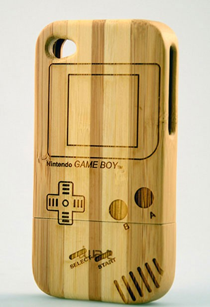

# Laser Cutting Overview

Laser cutting is an incredibly powerful and versatile making technology, allowing you to cut and/or engrave 2D shapes out of materials such as wood, acrylic, cardboard, and more. 

The General makerspace is home to 3 laser cutters;

* Fusion Edge 12 (Small Laser Cutter)
    * Work Area: 12 x 24 inches
    * Laser: 60W CO2
    * [Fusion Edge 12 User's Manual](https://www.epiloglaser.com/assets/downloads/manuals/fusionedge-manual-web.pdf)
* Fusion Edge 24 (Medium Laser Cutter)
    * Work Area: 24 x 36 inches
    * Laser: 60W CO2
    * [Fusion Edge 24 User's Manual](https://www.epiloglaser.com/assets/downloads/manuals/fusionseries-manual-web.pdf)
* Fusion Pro 48 (Large Laser Cutter)
    * Work Area: 36 x 48 inches
    * Laser: 120W CO2, 50W Fiber
    * [Fusion Pro User's Manual](https://www.epiloglaser.com/assets/downloads/manuals/fusionpro-manual-web.pdf)

**CO2 Lasers** are designed to cut and engrave things that burn, such as wood, but can also engrave some materials like stone or glass. **Fiber Lasers** are designed to engrave metals, and are ineffective on basically all other materials.

!!! tip
    Did you know the SHED also has a high-power metal-cutting laser? This 4500W fiber laser can cut through up to 1/4" steel plate! Check it out here; [Atrium Makerspace: Metal Laser Cutter](/Atrium%20Makerspace/South%20Shop%20Machines/Fablight%204500W)

## Using the Epilog Laser Cutters

Epilog laser cutters are very easy to use. To learn step-by-step how to use the laser, look at each of the following pages. 

**Also, make sure to review [Permitted and Restricted Materials](#permitted-materials) below!**

[Preparing Laser Files](./1%20Preparing%20Files.md){target="blank" .md-button}

[Using the Epilog Software](./2%20Software.md){:target="_blank" .md-button}

[Operating the Epilog Laser](./3%20Operating.md){:target="_blank" .md-button}

Want to level up your laser cutter skills? Make sure to check out the [Advanced Laser Cutting Tips & Tricks](./Tips%20and%20Tricks.md)!

## Permitted Materials
Any material that does not decompose into hazardous materials you can attempt to laser cut, but many materials cut better than others. Some examples of materials that work well are:

* Acrylic, thinner will cut better.

* Plywood, preferably high-grade birch or pine.

* Cardboard, cardstock, paper, etc.

* Anodized aluminum (engraving only).

* Removing paint from metal (engraving only).

* Non-sedimentary stone (engraving only).

    * Sedimentary stone engrave at your own risk, trapped water in the stone may turn to steam and cause cracks.

* Glass objects like wine glasses (engraving only).

* Bare metal (fiber engraving only).

* Silicon wafers or ceramics (fiber engraving only).

Materials from trusted laser cutting material suppliers such as makerstock.com marked as “Laser Compatible” are also okay.

## Prohibited Material
There are two reasons that a material cannot be laser cut;

* Hazardous Decomposition

* Incompatible with Laser

When a material is laser cut, it decomposes into base components. Some of these are hazardous and our filter system cannot handle them. Decomposition products can be found in the MSDS (Material Safety Datasheet). Here are some examples of decomposition products that are not allowed;

* Formaldehyde: Found in Delrin, pressure-treated plywoods, PTFE, Nylon, and artificial fleece. 

* Hydrogen Cyanide or any other Cyanide compounds: Found in ABS plastic, felt and fleece wools, and epoxy or epoxy-composites like carbon fiber.

* Hydrogen Chrloride or any other Chloride Compounds: Found in vinyl and PVC.

* Chlorine Gas: Found in some polycarbonates.

* Benzene: Found in many styrenes, such as polystyrene in foam boards.

If you are unsure if your material is safe to cut, consult makerspace professional staff.

Incompatibility with the laser is not well documented, and usually needs to be tested for. Materials that are incompatible either cannot be engraved by the laser, or react violently to the laser. For example:

* Some polycarbonates are invisible to CO2 lasers.

* Metals cannot be engraved by CO2 lasers.

* Some glass either cannot be engraved or shatters.

* Some rubbers melt instead of cutting.

* Some MDFs will burn instead of cutting.
