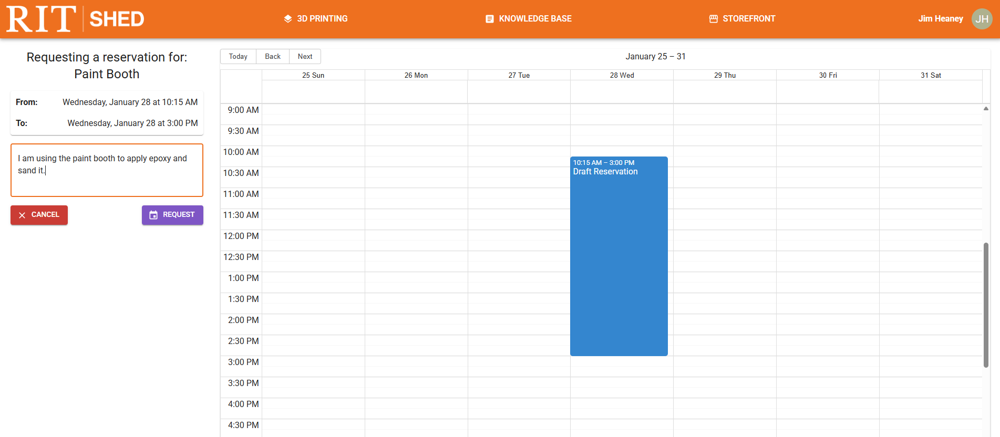

# Reservations

Certain equipment on make.rit.edu needs to be reserved before it can be used. There are 2 types of reservable equipment;

* Staff-Approved Use: For things like the welding booths, you must talk with professional staff to gain access, no matter what. Email make@rit.edu to get in touch.
* Self-Scheduled: For things like the paint booth, you can make your own reservations online to book the equipment.

## Self-Scheduling Equipment

To make a reservation on self-scheduled equipment, click the purple "Reserve" button on the equipment card. This brings up a calendar.

Reservations will be marked in *purple* if they are pending approval, or *orange* if they are already approved by staff. You will be able to see your name and information next to reservations you make, but not other people's. 

To create a reservation, click and drag on the calendar. Once you select the times, you can enter details on the left side and hit the "Request" button to submit your reservation. 

Once your reservation is approved, it will turn orange. If your reservation is denied, it will be removed from the calendar. 

