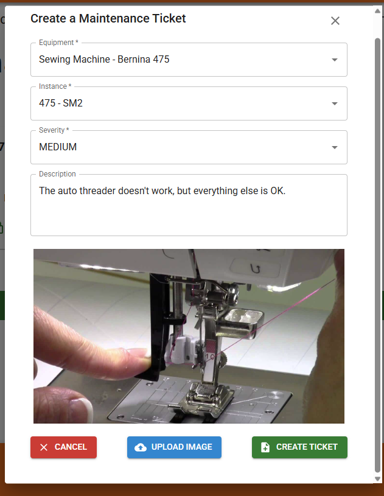
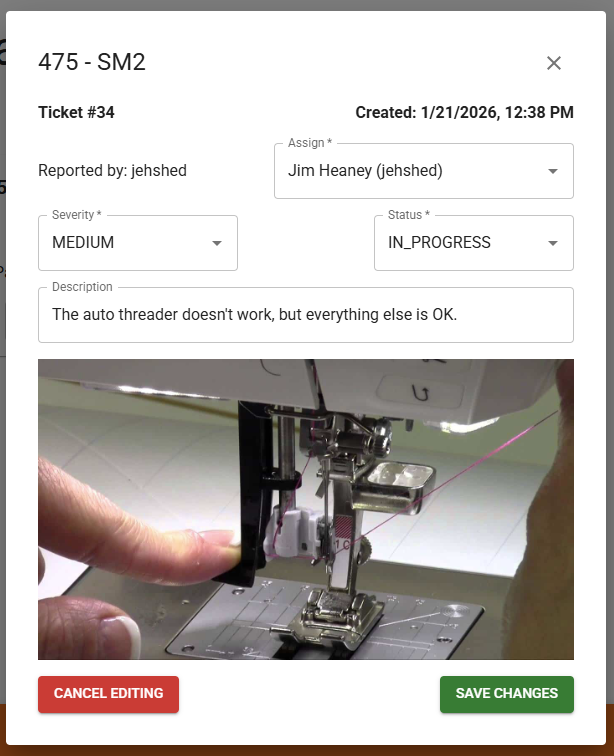
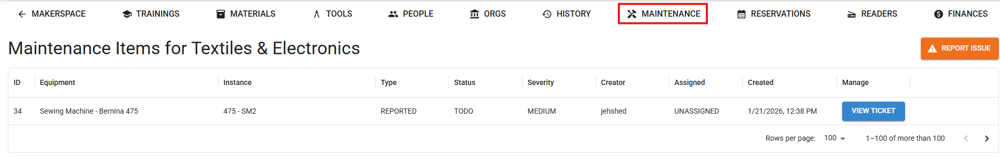

# Ticket System

Staff can use the make.rit.edu maintenance ticket system to report equipment issues. 

**The ticket system should be used to report all issues, no matter how minor, and in addition to any verbal/written reports of the issue.**

**A ticket MUST be opened any time a piece of equipment is locked out!**

## Open a Ticket

1. Find the piece of equipment on make.rit.edu, and hit the orange manage icon in the top right corner (where you also can lockout/unlock equipment!).
2. At the bottom, hit the orange "Report Issue" button. 
3. If there are multiple instances of the equipment (i.e. which of the 4 sewing machines) select it in the "Instance" menu.
4. Set a severity level
    * HIGH: The machine is unusable until this is fixed.
    * MEDIUM: The machine is performing at reduced function or is missing features until this is fixed.
    * LOW: Aesthetic issues, issues with optional accessories, minor damage that doesn't impact operation, etc.
5. Describe the issue. Be brief, but add as much pertinent info as you can.
6. (Optional) Hit "Upload Image" to attach a picture to help explain the issue.
7. Hit "Create Ticket" to submit the issue.
8. Make sure your ticket appears at the bottom of the page. 

## Check & Edit Current Tickets

You can see all open tickets on a piece of equipment under the "Maintenance Tickets" section. By clicking the "Manage" button, you can see more information about the ticket, as well as see the attached image. 

When managing a ticket, you can click "Edit" to make changes, such as adding to the description or changing the severity. This is also where the ticket's status can be changed (in progress, closed, etc.), as well as changed who the ticket is assigned to. *If you are doing work on fixing a ticket, you should assign it to yourself and change the status to "In Progress"*. 

## View All Tickets (Including Closed Ones) 

When a ticket is closed, it is hidden from the equipment page. To see these closed tickets, as well as see all tickets in one convenient spot, you can use the "Maintenance" tab. 

In this view, you can see all tickets, sort and filter them, manage tickets, or open new tickets. 

